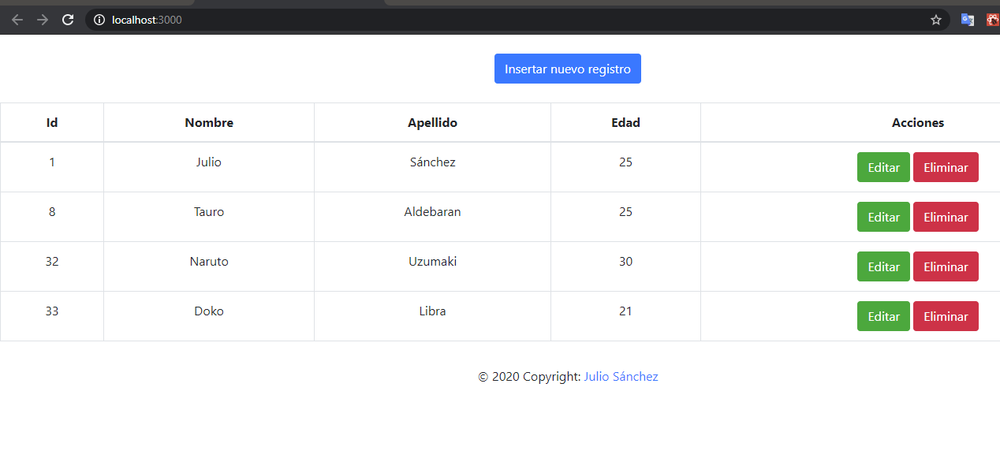

This project was bootstrapped with [Create React App](https://github.com/facebook/create-react-app).

## Available Scripts

In the project directory, you can run:

### `npm install`
## `npm start`

Runs the app in the development mode. 
Open [http://localhost:3000](http://localhost:3000) to view it in the browser.

## React con ASP.Net Core web api
### Practica
Aplicación CURD Fullstack con ASP.NET Core y Reactjs

Api rest http://personadbrestapi.somee.com/api/persona

  

Ejemplo

 
